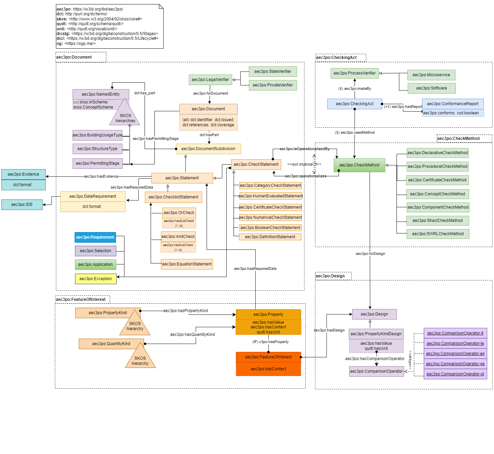

# AEC3PO: Architecture Engineering and Construction Compliance Checking and Permitting Ontology

## Description

The Architecture Engineering and Construction Compliance Checking and Permitting Ontology (AEC3PO) is a central ontology developed in the context of the Horizon EU project ACCORD. AEC3PO is a comprehensive ontology designed to represent the compliance and permitting stage in the construction domain. It aims to capture and model various aspects related to building compliance, engineering standards, and permitting processes in the architecture, engineering, and construction industry. The ontology is built using Semantic Web technologies, adhering to standards like RDF, OWL, and SKOS. It provides a formal and standardised representation of the knowledge and information related to compliance and permitting requirements in the construction domain. 

## Namespace
The AEC3PO ontology's namespace is `https://w3id.org/lbd/aec3po/`.
The prefixed is `aec3po:`.  


## Ontology Requirements

### As Defined in ACCORD Proposal

T2.2  Development of the  Building  Compliance  Ontology (BCU,VTT,  CU,  FRA,  ONTO,  SOL,  FUI,  IMT, FUNITEC, JU)[M8-M16]: Drawing on literature, expert interviews, T2.1 and WP1, develop a conceptual ontological model of building compliance requirements,  including laws,  regulations, processes,  and  documentation. This Building Compliance Ontology (BCO) is open-ended, and not tied to specific regional or legal systems.It is aligned  and  compatible  with  established  standard ontologies for  representing both generic concepts  (time, processes, files/document metadata) and the building domain specifically (building topology, construction projects). Specific laws, regulations, processes, and documentation will be implementations of this generic model. (D2.2) 
  
### Competency Questions

#### Compliance
1. How to define the metadata of a Document that informs/dictates compliance checking?
2. What is the coverage of a Document per Administrative Area?
3. What are the parts of a document, their unique identifiers and order?
4. How to represent cross-referencing in a document?
5. What type of information (Statement) does a Document contain?
7. What categories or types of check statements can a check statement belong to?
8. What type of check methods needs to be performed for a Statement to comply?
9. Which check statement does a check method operationalize?
10. What are the required data to perform a check?
11. Which feature of interest needs to be checked and how it is designed?
12. Which checking act needs to be made and which check method it uses?
13. How to access the outcomes of a checking act?
14. How to transform normative documents into a single well-defined rule which can be implemented into BIM / IFC based model checking software using RASE methodology?

#### Permitting
 1. What are the stages of the Permitting process per Administrative Area?
 2. What evidence is required in each stage?
 3. Which standards the permitting stages are related to?
 4. What types of checks and verifications are necessary to ensure compliance with building regulations during the permitting phase?

## Overview of AEC3PO modules and alignements

### AEC3PO Ontology
The AEC3PO ontology is designed to represent various aspects of the construction domain, focusing on compliance and permitting. It is organised into five main modules, each comprising sub-modules, classes, and properties. These modules facilitate the modeling of different components and relationships within the construction domain. The figure below shows an overview of these modules and the relations among them.

 
Below is an overview of each module and its sub-components:
1. **Module 1: Document**
  - Classes: _DocumentSubdivision_, _Statement_, _CheckStatement_, _DefinitionStatement_, _ChecklistStatement_, _Evidence_, _DataRequirement_, _etc_.
  - Properties: hasPart, hasRequiredData, hasEvidence, forDocument, hasPermittingStage, etc.

2. **Module 2: CheckMethod**
  -	Classes: _CheckMethod_, _BooleanCheckMethod_, _ComponentCheckMethod_, _SHACLCheckMethod_, _etc_.
  -	Properties: _hasSubCheck_, _operationalize_, _forDesign_, _etc_.

3. **Module 3: Design**
  -	Classes: _Design_, _PropertyDesign_, _ComparisonOperation_, _etc_.
  -	Properties: _hasDesign_, _hasPropertyDesign_, _hasComparisonOperator_, _etc_.
  
4. **Module 4: FeatureOfInterest**
  - Classes: _FeatureOfInterest_, _Property_, _PropertyKind_, _QuantityKind_
  -	Properties: _hasProperty_, _hasQuantityKind_, _hasPropertyKind_, _hasUnit_, _hasDesign_, _hasContext_, _etc_.
  
5. **Module 5: CheckingAct**
  - Classes: _CheckingAct_, _ProcessVerifier_, _ConformanceReport_
  - Properties: _usedMethod_, _madeBy_, _hasReport_
  
Each module encompasses classes that represent specific entities or concepts in the construction domain. For example, the **_Document_** module deals with different types of statements, evidence, and related properties. The **_CheckMethod_** module focuses on different types of check methods, such as procedural, declarative, boolean, component, and SHACL checks. 
Similarly, the **_Design_** module includes classes representing design-related concepts, while the **_FeatureOfInterest_** module deals with features like building components and spaces. The **_CheckingAct_** module represents different verifier roles, their associated methods, and the conformance report that stores the outcomes of the check. 

### AEC3PO Alignments
AEC3PO contains five modules, each of them imports an external ontology, and specifies a set of alignment axioms to connect the terms of the imported ontologies with each other. The figure below illustrates the alignment of the AEC3PO ontology with various other ontologies, showcasing how different domains and concepts interconnect for a comprehensive representation of compliance and permitting in the construction industry.

In the figure, the AEC3PO ontology is positioned at the center, with arrows extending outward to connect with other related ontologies. Each ontology is represented as a distinct node, emphasising the integration of diverse knowledge domains. The alignment signifies the synergy achieved by harmonising multiple ontologies to enhance the overall understanding and modeling of compliance and permitting processes in the construction sector.


The figure above effectively conveys the interconnectedness of different ontologies with AEC3PO for a holistic understanding of compliance and permitting processes in the construction industry. This alignment facilitates cross-domain information sharing, enabling more accurate and comprehensive modeling of the complex construction ecosystem. The table below lists all the external ontologies, the namespaces and the suggested prefix for each ontology modules is also provided.

:PROPERTIES:
:CUSTOM_ID: total-entities
:END:
| Ontology          |      Namespace | prefix    | Description                                                                                         |
|-------------------+--------------------------------------------------------+--------------------+------------------------------------------------------------------------------|
| dct        |  [http://purl.org/dc/terms/](http://purl.org/dc/terms/)  |     dct:      |The Dublin Core Terms (DCT) ontology is used within the "AEC3PO" ontology to provide a standardised framework for describing and managing metadata related to documents and other resources in the construction compliance and permitting context. |


## Examples

Folder `examples` contains examples for AEC3PO

## Alignments

Folder `external` contains useful excerpts of external ontologies and vocabularies that may be considered useful for the development or alignemnt of AEC3PO.
Terms in the AEC3PO may be aligned to 

## AEC3PO Dissemination

## Pre-commits

run `pre-commit install` to set up the git hook scripts:

```
$ pre-commit install
pre-commit installed at .git/hooks/pre-commit
```

now `pre-commit` will run automatically on `git commit`!

you can also run `pre-commit` once on all files:

```
pre-commit run --all-files
```

## CI/CD pipeline

A CI/CD pipeline must be developed to validate the ontology, generate the ontology artifacts, release the ontology.

* The `public` folder is ignored by git. It is where temporary files are generated.  
* The HTML Documentation may be automatically generated using ex. pyLODE.
* The `public` folder may be published to a server.

## TBC


