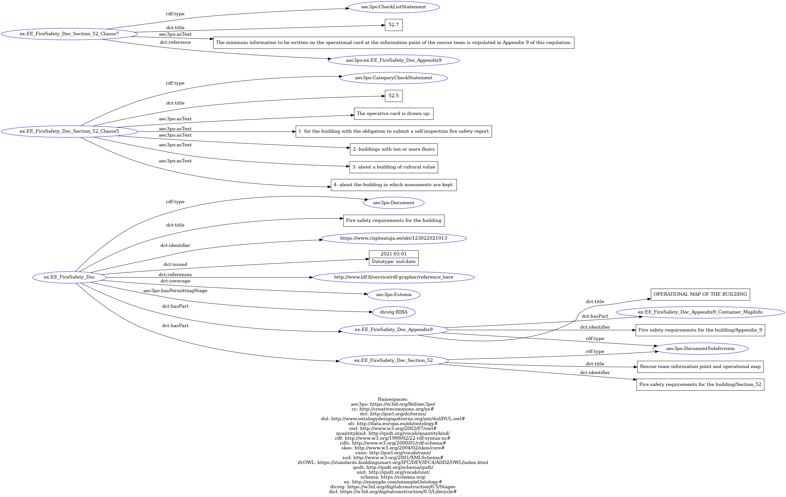

# Estonia Demo Case

In this example, we have instantiated the AEC3PO ontology with Estonia demo case 1. The demo is related to _fire safety_ and needs to be checked against the _Fire safety requirements for the building_ regulations, which is an Estonian legistlation issued on 01-03-2021. Two statements from these regulations have been selected with respect to the checks needed for this use case. These two statements represent two rules related to the **operational map of the building**. These two statements are respectively presented in _section52, clauses 5 and 7_, and the respective clauses are shown below in both original Estonian version and the English translation version. 

### Statement 1 (Clause 52.5)
* Original - Estonian: _" Operatiivkaart koostatakse:_
  1. _enesekontrolli tuleohutusaruande esitamise kohustusega ehitise kohta;_
  2. _kümne- ja enamakorruselise hoone kohta;_
  3. _kultuuriväärtusliku hoone kohta;_
  4. _hoone kohta, milles hoitakse mälestisi. "_
     
* Translation - English: _"The operative card is drawn up:_
  1. _for the building with the obligation to submit a self-inspection fire safety report;_
  2. _for buildings with ten or more floors;_
  3. _about a building of cultural value;_
  4. _about the building in which monuments are kept."_

### Statement 2 (Clause 52.7)
* Original - Estonian: _"Päästemeeskonna infopunktis olevale operatiivkaardile kantav minimaalne teave on sätestatud käesoleva määruse lisas 9."_
  
* Translation - English: _"The minimum information to be written on the operational card at the information point of the rescue team is stipulated in Appendix 9 of this regulation."_ 

The example is presented in the file _“Estonia_Example.ttl”_. The figure below represent a part from AEC3PO instantiation that corresponds to the Document (**_aec3po:Document_**) instantiation and the two statements
 

Here's a breakdown of some of the RDF triples related to the _statement_ classification and the _feature of interest_:
*	The first statement (_clause52.5_) represents a **CategoryCheckStatement** and it is defined as follows: **_"ex:EE_FireSafety_Doc_Section_52_Clause5 a aec3po:CategoryCheckStatement ;"_** .
*	The second statement (_clause52.7_) represents a **CheckListStatement** and it is defined as follows: **_"ex:EE_FireSafety_Doc_Section_52_Clause7 a aec3po:CheckListStatement ;"_** . This **CheckListStatement** contains a list of **BooleanCheckStatement**, defined with the class **_aec3po:BooleanCheckStatement_** and linked to the **CheckListStatement** with the property **aec3po:hasSubCheck**.

*	The **Operational Map** has been defined as the **_aec3po:FeatureOfInterest_** and all its properties have been defined with the class **_aec3po:Property_**.

