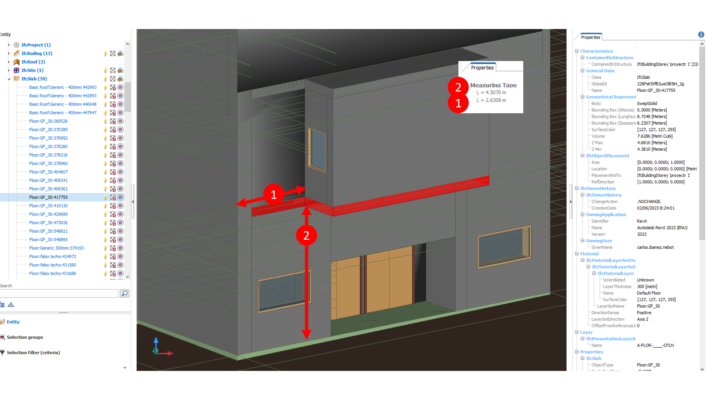

# Spain Demo Case
## add description of the selected "rules" and the solution using aec3po

This example is provided in the file "Spanish_Example.ttl". This file provides an example of instantiating the aec3po ontology using Turtle syntax with the Spanish demo case. Two rules have been used in this example. Both of them are related to the numerical check of a cantilever of a cultural centre. The rules are defined in clauses 54.8 and 63.3 from the POUM - the Municipal Urban Planning Plan Definitively approved by the Barcelona Territorial Planning Commission on 13-07-2005, respoectively in Part2/Chapter1/Section2 and Part2/Chapter2/Section 2. The statements of the two rules are definedd below in both original spanish text and its English translation. 

### Statement 1 (Clause 54.8)
* Original - Spanish: " L’alçada lliure mínima dels voladissos sobre espais públics serà de 3,20 metres per a vials de 8,00 metres o menys de i de 3,50 metres en la resta de casos. "
* Translation - English: " The minimum free height of cantilevers over public spaces will be 3.20 metres for street with a width of 8.00 metres or less and 3.50 metres in all other cases."

### Statement 2 (Clause 63.3)
* Original - Spanish: " Tots els voladissos hauran d'estar separats 1 metres com a mínim, de la línia de la mitgera. "
* Translation - English: " All cantilever must be separated by at least 1 meter from the line of the partywall. " 
