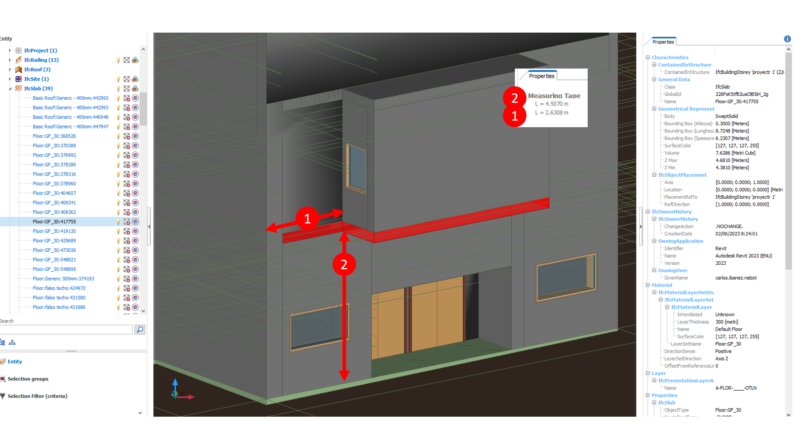

# Spain Demo Case

In this example, we have instantiated the AEC3PO ontology with the Spain demo case. The demo represents a cultural centre (as shown in the figure above) that needs to be checked against the regulations presented in the _POUM_ document, which is the Municipal Urban Planning Plan Regulations document, definitively approved by the Barcelona Territorial Planning Commission on 13-07-2005. Two statements from the POUM document have been selected with respect to the checks needed for this building model, as shown in the figure. These two statements represent two rules related to the base Offset and the party-wall distance of the cantilever of this building. These two statements are respectively presented in _Part2/Chapter1/Section2_ and _Part2/Chapter2/Section2_ from the POUM document, and the respective clauses are shown below in both original Spanish version and the English translation version. 

### Statement 1 (Clause 54.8)
* Original - Spanish: _" L’alçada lliure mínima dels voladissos sobre espais públics serà de 3,20 metres per a vials de 8,00 metres o menys de i de 3,50 metres en la resta de casos. "_
* Translation - English: _"The minimum free height of cantilevers over public spaces will be 3.20 metres for street with a width of 8.00 metres or less and 3.50 metres in all other cases."_

### Statement 2 (Clause 63.3)
* Original - Spanish: _" Tots els voladissos hauran d'estar separats 1 metres com a mínim, de la línia de la mitgera. "_
* Translation - English: _" All cantilever must be separated by at least 1 meter from the line of the partywall. "_ 

The example is presented in the file _“Spanish_Example.ttl”_. Here's a breakdown of some of the RDF triples:
*	The **_ex:POUM_Doc_** individual is defined as a an instance of the class **_aec3po:Document_**. It has a coverage related to the administrative area **_aec3po:Spain_**. 
* The **_ex:statement_54_** and **_ex:statement_63_** are defined as instances of the class **_aec3po:Statement_**, with respect to the clause number in the POUM document. They are defined by their text captured with the property _asText_ and linked to the document subdivision with the property _hasPart_. 
*	The **_ex:cantilever_checklist_** individual is defined as a subclass of **_aec3po:Statement_** and has as subclasses **_ex:cantiliver_numericalCheckStatement_streetBaseOffset_**, **_ex:cantiliver_numericalCheckStatement_otherBaseOffset_**, and **_ex:cantiliver_numericalCheckStatement_partywall_distance_** - the numerical check statements related to every property to be checked as described in the clauses, which are the base off set and the party-wall distance. 
* The **_ex:cantilever_** individual is defined as an instance of the class **_aec3po:FeatureOfInterest_**, which represents the IFC element to be checked. It has been defined by its properties defined as **_aec3po:Property_**, and linked to it with the property _aec3po:hasRequiredData_.

