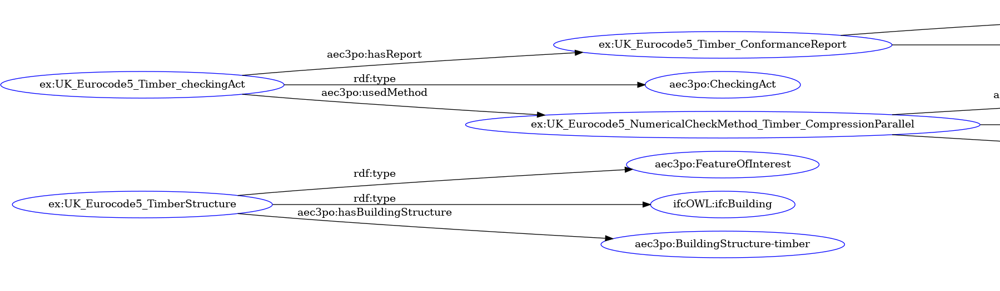

# UK Demo Case : A a numerical check from structural engineering

This folder contains an example of AEC3PO ontology instantiation from the UK demo cases. This example is presented in the file_UK_Structure.ttl_ and treats the check in compression parallel to the grain in timber structures, as described in the latest version of Eurocode 5 (EN 1995-1-1:2004+A2:2014). Eurocode 5 is the default source document for national codes in Europe for the design of timber structures.
The example implements _**Clause 6.1.4**_ of this document. The specific excerpt from the code (**_Statement_**) is presented below:
 

In order to solve this case, an expert has defined the required inputs for this check. The figure below represents the interpretation of the check and its inputs.  
 

The figure below represents a part from AEC3PO instantiation that corresponds to the Checking Act operation (**_aec3po:CheckingAct_**) instantiation and the the Feature of Interest instantiation (**_aec3po:FeatureOfInterest_**), respectively.
 

