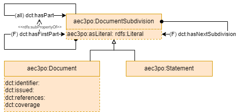

# Document

The AEC3PO Document module describes building-compliance related documents, their subdivisions, down to individual statements.

Document subdivisions can be described as literals, link to their first part, and to their immediate following subdivision. This enables roundtripping from a document to its AEC3PO description, and back.

