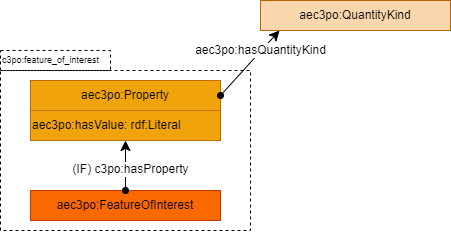

# Feature of Interest

The AEC3PO Feature of Interest module describes the objects (FeatureOfInterest) and the aspects thereof (Properties) whose conformance against checks is verified.
Properties have some quantity kind, and are valued. 

